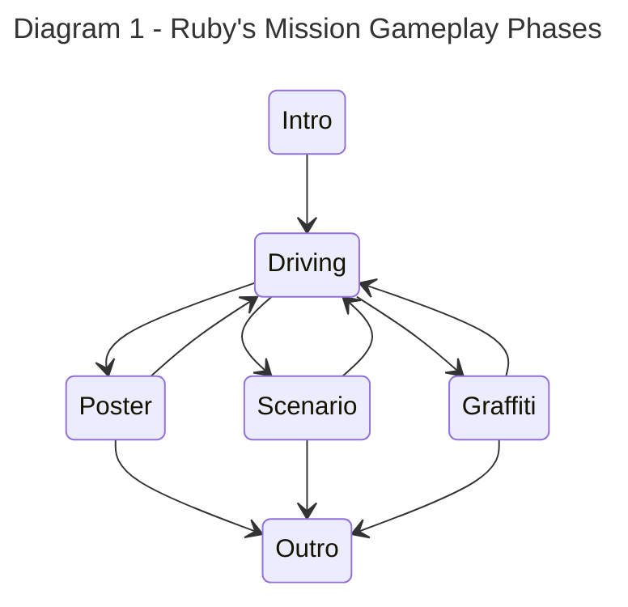

# Annotation Scheme for Social Interactions in Ruby's Mission

**How to use this document?** TODO: write a short paragraph on how to use this document.

# Background

The annotations for social interaction are based on the Stimulus-Response (SR-)model from psychology. Social interaction is the way in which persons mutually influence one another (Bardis, 1979). The SR-model says that every social action is determined by the previous social action of another person (Argyle, 2017). Our annotation rules are based upon this model of social interaction. It has been slightly adjusted to better fit within our specific context. 

### References

- Argyle, M. (2017). Social interaction: process and products. Routledge.
- Bardis, P. D. (1979). Social interaction and social processes. Social Science, 54(3), 147-167.

# Annotation rules

The present scheme only considers verbal actions for annotations. A **verbal action** is any sound an individual produces with their voice that contains language. Verbal actions are categorized as either a [stimulus](#stimulus), as a [response](#response), or as [ambiguous](#ambiguous). In the present annotation scheme a **conversation** refers to a stimulus followed by _at least one_ response. 

Following this section is a extensive overview of the rules for annotating verbal actions according to the present annotation scheme. For a compact overview of the annotation rules, please refer to the [overview of the annotation rules](#overview-of-the-annotation-rules).

### Stimulus 

A **stimulus** is either **(a)** a verbal action that is intended for others to respond to _verbally_ (through a verbal action), or  _in-game_ (through an action in the video game); or **(b)** a verbal action that others respond to _verbally_, even though this was not the speakers intention. 

A stimulus may also be used as a response during social interaction. These verbal actions (that are both stimulus and response) are annotated as a _response_ in the present annotation scheme (see [Section "Response"](#Response), Rule 2).

The stimulus category has been subdivided into multiple sub-categories relevant for our social context. **(Rule 1)** A verbal action is considered a stimulus when it fits within any of the following sub-categories:

---

  - **(Category 1) Question:** a verbal action that contains a _question_ directed to at least one _other_ person in the group.

    ```mermaid
    sequenceDiagram
        title Voorbeeld van een vraag (categorie 1)
        actor Kind 1
        actor Kind 2
        Kind 1->>Kind 2: "Had jij echt je moeders telefoon gesloopt?"
    ```
    
 <!--   > **Example 1**\
    > **Kind:** "Had jij echt je moeders telefoon gesloopt?" (cat. 1)
    > 
    > **Example 2**\
    > **Kind:** "Ja! Waar moet ik heen?" (cat. 1) -->

---
  
  - **(Category 2) Command:** a verbal action that contains a _command_ directed to at least one _other_ person in the group. See two examples below.

    ```mermaid
    sequenceDiagram
        title Voorbeeld van een commando (categorie 2)
        actor Kind 1
        actor Kind 2
        Kind 1->>Kind 2: "Hij moet wel op die muur komen he."
    ```

    _The example illustrates a child commanding others to add their answers to the poster mini-game onto the city so that everyone can read them._

  - **(Category 3) Remark about:** a verbal action contains a _remark about_ at least one _other_ person in the group.

    ```mermaid
    sequenceDiagram
        title Voorbeelden van een opmerking over een ander (categorie 3)
        actor Kind
        Note right of Kind: Het kind maakt een opmerking over de bestuurder.
        Kind->>Groep: "[naam] is zo slecht in bestuurder he. Zo slecht."
    
        Note right of Kind: Later in het spel maakt het kind weer een opmerking over de bestuurder.
        Kind->>Groep: "Goed zo, goed zo [naam]. Zij krijgt het onder de voet. Niet onder de knie, maar onder de voet."
    ```

    _Both examples are drawn from the same game session. In the first example, the child criticizes the driver's performance to the group. Later in the game (example 2), the child mentions that the driver is gradually improving in their role._

  
  - **(Category 4) Remark to:** a verbal action contains a _remark_ meant for at least one _other_ person in the group. Verbal actions about the shared task (i.e. the gameplay) are also considered as this sub-category. See an example below.
    
    ```mermaid
    sequenceDiagram
        title Voorbeelden van opmerkingen aan een ander (cateogrie 4). 
        actor Kind
        Note right of Kind:  Het kind geeft hier aan dat ze een blauwe graffiti tag ziet.
        Kind->>Groep: "Die blauwe!"
        Note right of Kind: Vervolgens communiceert het kind naar de groep dat zij hiernaartoe navigeert.
        Kind->>Groep: "Ik ga naar die blauwe!"
    ```

    **Category 4 continued:** Verbal actions that consist of reading out-loud what is on the screen are **not** considered this category. You may find all information on written texts in the [mini-game section](#mini-games) for reference during annotating. Consider the following example:

    ```mermaid
    sequenceDiagram
        title Voorbeeld van voorlezen.
        actor Kind
        Kind->Kind: "Toen ik mijn advies kreeg. Lachen."
    ```

    _In this scenario, the child reads aloud the answer provided by another player during the poster mini-game. Simply reading aloud from the screen doesn't qualify as a stimulus, as it's merely a passive action without prompting or provocation._

---

  - **(Category 5) Unintended:** any verbal actions that _another_ person in the group responds to, even though this may not have been the speakers intention. You may find an example below.

    ```mermaid
    sequenceDiagram
        title Voorbeeld van niet intentionele stimulus (categorie 5).
        actor Kind 1
        actor Kind 2
        Kind 1->>Kind 1: "We wachten nog op [...] en [...], als beslisser kan je straks op verder klikken."
        Kind 2->>Kind 1: "[onverstaanbaar] ik ben heel slecht in typen oke, dus eehh..."
    ```
    
    _In this scenario, the first child reads aloud the text displayed on the screen. Just reading aloud wouldn't typically be seen as a stimulus according to category 4. However, because the second child responds to this by apologizing for being a slow typer and asking for patience from the others, the original action of reading aloud becomes an unintentional stimulus._
    
---

### Response

A **response** (category 6) is any verbal action that is a reaction to **another person's _verbal action_** (stimulus or response, not in-game or physical actions) **(Rule 2)**. Below are the rules regarding the annotation of responses:

- **(Rule 3)** A stimulus can be used as a response. In this case, the verbal action is **always** annotated as a response (cat. 6). Consider the example below.

    ```mermaid
    sequenceDiagram
        title Voorbeeld van regel 3 (categorie 6).
        actor Verzamelaar
        actor Bestuurder
        Verzamelaar->>Bestuurder: "Ga die kant op!" (categorie 2)
        Bestuurder->>Verzamelaar: "Welke kant?" (categorie 6)
        Verzamelaar->>Bestuurder: "Naar rechts." (categorie 6)
    ```
    
  _In the example, the first line involves a command (category 2) instructing the driver to move in a specific direction. The second line shows the driver responding with a question (category 6), seeking clarification on the precise direction to take. Then, the collector responds with a remark about the shared task (category 6), offering clarity on the correct direction. Because both verbal actions in lines 2 and 3 are reactions to prior stimuli or responses, they are both categorized as responses._


- **(Rule 4)** When a person follows up with multiple consecutive verbal actions within the context of a response to another person, each of these verbal actions are categorized as a response. For example:

    ```mermaid
    sequenceDiagram
        title Voorbeeld van regel 4 (categorie 6).
        actor Kind 1
        actor Kind 2
        Kind 1->>Kind 2: "Hoe denk jij dat Thijs zich kan voelen?" (categorie 1)
        Kind 2->>Kind 1: "Hmm, ik denk misschien wel boos..." (categorie 6)
        Note over Kind 1, Kind 2: Korte pauze waarin kind 2 nadenkt.
        Kind 2->>Kind 1: "En ook wel jaloers!" (categorie 6)
    ```

  _In the scenario, the second child initially responds to the initial question. Then, after a few seconds of contemplation, a second answer is given to the same question. Since both verbal actions are reactions to the initial stimulus, they are categorized as responses (category 6)._


- **(Rule 5)** During a conversation the topic of the conversation may **transition naturally**. In this case, consecutive verbal actions are continued to be categorized as responses. When a verbal action introduces an **abrupt change** of topic, the action is **not** categorized as a response. Consider this example during the scenario mini-game for the emotion 'jealousy'. 

    ```mermaid
    sequenceDiagram
        title Voorbeeld van regel 5 (categorie 6).
        actor Kind 1
        actor Kind 2
        Kind 1->>Kind 2: "Hoe zou Thijs zich kunnen voelen?" (categorie 1)
        Kind 2->>Kind 1: "Jaloers." (categorie 6)
        Kind 1-->Kind 2: [...]
        Kind 2->>Kind 1: "En eeh... Boos." (categorie 6)
        Kind 1->>Kind 2: "Boos, maar ook bang." (categorie 6)
        Kind 1-->Kind 2: [...]
        Kind 1->>Kind 2: "Hij is bang." (categorie 6)
        Note over Kind 1, Kind 2: Hier vindt een natuurlijke transitie plaats van 'hoe<br/>Thijs zich zou kunnen voelen' naar 'waarom Thijs<br/>bang zou zijn'. Opeenvolgende verbale acties op<br/>hetzelfde onderwerp gaan door als response.
        Kind 2->>Kind 1: "Hoezo is die bang?" (categorie 6)
        par Kind 1 aan Kind 2
            Kind 1->>Kind 2: "Hij kan zich, wacht even hoor [...] Hij kan zich verbranden." (categorie 6)
        and Kind 2 aan Kind 1
            Kind 2->>Kind 1: "Mijn ou... Mijn ouders zijn bang. Niet hijzelf." (categorie 6)
        end
        Note over Kind 1, Kind 2: Hier vindt een abrupte transitie plaats van 'waarom<br/>Thijs zich bang zou kunnen voelen', naar 'hoe Thijs<br/>zich zou kunnen voelen'. Deze verbale actie wordt<br/>in dit geval gecategoriseerd als stimulus.
        Kind 1->>Kind 2: "Ik zeg eerlijk. Hij voelt zich ook blij" (categorie 4) 
    ```

### Ambiguous

Situations may arise in which it is **ambiguous** (category 7) how to categorize a verbal action. The following rules are in place to handle these situations:

- **(Rule 6)** When it is ambiguous whether a verbal action categorizes as a response **and** the verbal action clearly categorizes as a stimulus, the verbal action is then annotated as a stimulus (i.e. cat. 1 to 5).

- **(Rule 7)** When it is not evident if a verbal action categorizes as a stimulus or as a response, the verbal action is categorized as ambiguous (cat. 7).

- **(Rule 8)** When it is evident that a verbal action does **not** categorize as a stimulus or as a response, the verbal action is **not** categorized (i.e. left unlabeled).


## Overview of the Annotation Rules

This section provides a compact overview of the annotation rules. Please refer to the previous sections for more extensive descripitions.

- **(Rule 1)** A verbal action is considered a **stimulus** when it fits within any of its sub-categories: (category 1) question, (category 2) command, (category 3) remark about another in the group, (category 4) remark directed to at least one other person in the group, or (category 5) unintended stimuli (verbal actions that others respond to, although this may not have been intended).

- **(Rule 2)** A verbal action is considered a **response** (category 6) when this action is a reaction to **another person's _verbal action_** (stimulus or response)

- **(Rule 3)** A stimulus can be used as a response. In this case, the verbal action is **always** annotated as a response (category 6).
  
- **(Rule 4)** When a person follows up with multiple consecutive verbal actions within the context of a response to another person, each of these verbal actions are categorized as a response.

- **(Rule 5)** During a conversation the topic of the conversation may transition smoothly. In this case, consecutive verbal actions are continued to be categorized as responses. When a verbal action introduces an abrupt change of topic, the action is **not** categorized as a response.

- **(Rule 6)** When it is ambiguous whether a verbal action categorizes as a response **and** the verbal action clearly categorizes as a stimulus, the verbal action is then annotated as a stimulus (i.e. categories 1 to 5).

- **(Rule 7)** When it is not evident if a verbal action categorizes as a stimulus or as a response, the verbal action is categorized as ambiguous (category 7).

- **(Rule 8)** When it is evident that a verbal action does **not** categorize as a stimulus or as a response, the verbal action is **not** categorized (i.e. left unlabeled).


# Gameplay

The gameplay of Ruby's Mission can be divided into two main phases: driving through the game world to collect graffiti tags and playing in one of three mini-games. These two phases alternate one another until all mini-games have been completed. Refer to the Diagram 1 (below) for a graphical overview of the phase transitions.



While navigating through the city (referred to as "Driving" in Diagram 1), players have two main objectives. Firstly, they aim to collect various graffiti tags scattered across the game world to unlock graffiti mini-games. Secondly, they navigate to points of interest to engage in scenario and poster mini-games.

At the beginning of the game, each player is assigned a role. One player takes on the role of the **driver**, responsible for steering Ruby (and the group) through the city during the "driving" phase. They can move Ruby using clicks in the game world or by using the 'WASD' keys, with other players automatically following the same path.

Another player is designated as the **decider**, tasked with communicating the group's answers during mini-games to Ruby. Refer to the [mini-game section](#mini-games) for details on specific decisions to be made.

The remaining player or players (depending on whether there are three or four players in the group) assume the **collector** role. Collectors are responsible for gathering graffiti tags scattered throughout the city during the driving phase, accomplished by clicking on the tags with their cursors.


## Mini Games

TODO: add descriptions for the various mini-games. Include screenshots for each of the screens such that the annotators know what is on the screen. 


# Adjustments in the annotation scheme

- Might need to clarify the definition of category 6, _"All verbal actions using language as a response to another person's verbal or non-verbal actions"_. Two reasons for this consideration are:
   - The data is often ambiguous on whether or not the participants respond to an in-game action.
   - Typical responses to non-verbal actions are singular, meaning that only a single response (per person) is given on an action.
  
  To resolve this issue, we ~may consider removing~ removed the _"non-verbal actions"_ part from category 6.

- For category 4, _"Remarks that are **about** at least one other person in the group"_, it is often ambiguous between when a remark was actually intended to be communicated to another and when it was merely a remark to the person self.
   - We may resolve this by adding a rule that **all** remarks about the common task (the game) are considered remarks to others.
   - ~We may **not** annotate these interactions at all.~ 


# Labels in the project
1. Question
2. Command
3. Remark about
4. Remark to
5. Unintended
6. Response
7. Ambiguous
