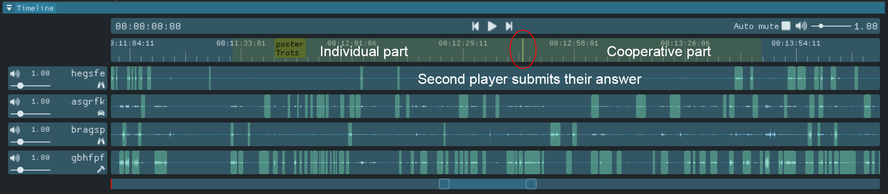
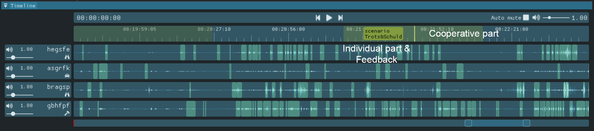
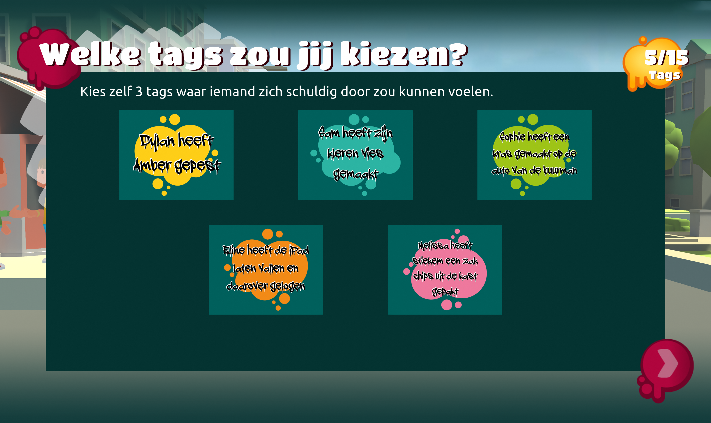
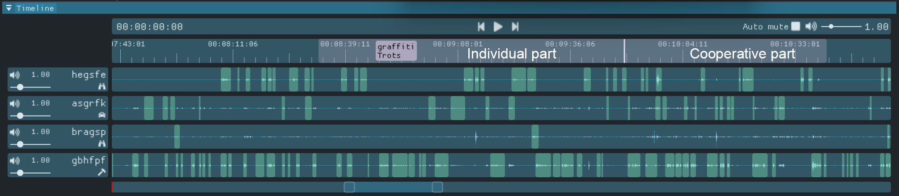

# Annotation Scheme for Social Interactions in Ruby's Mission

# Table of Contents

- [Introduction](#introduction)
  - [How to use this document?](#how-to-use-this-document)
- [Background](#background)
- [Annotation Rules](#annotation-rules)
  - [Stimulus](#stimulus)
  - [Response](#response)
  - [Other](#other)
- [Overview of the Annotation Rules](#overview-of-the-annotation-rules)
- [Gameplay](#gameplay)
  - [Mini Games](#mini-games)
    - [Poster Game](#poster-game)
    - [Scenario Game](#scenario-game)
    - [Graffiti Game](#graffiti-game)
- [Setting up a Project](#setting-up-a-project)
- [Adjustments](#adjustments-in-the-annotation-scheme) (documentation only)

# Introduction 

This document describes the rules for annotating social interactions of the participants while playing the first level of Ruby's Mission. Before we can start annotating, we go through the following steps:

1. **Briefing:** We provide a brief overview of the study's purpose and explain the role of annotations within this context.
2. **Ruby's Mission:** We play Ruby's Mission ourselves to familiarize ourselves with the game and the tasks participants were required to complete.
3. **Reading the document:** It's crucial to thoroughly read the document from start to finish before proceeding with any annotations. Failing to do so might lead to discovering exceptions in annotation rules later, potentially invalidating previous work.
4. **Annotation Tool:** We distribute the annotation tool and offer a brief explanation on how to use it. A more detailed guide to the tool can be found [here](./README.md).
5. **Interrater Reliability:** Finally, we assess interrater reliability by annotating various sections of multiple gameplay sessions. The head researcher and all annotators participate in this process. If reliability is deemed insufficient, we discuss inconsistencies and make necessary adjustments to the annotation scheme. This iterative process continues until satisfactory interrater reliability is achieved.


## How to Use This Document?

As outlined in the [Introduction](#introduction), it's essential to thoroughly read the document before beginning annotations. Once familiarized with the content, the document serves as a guide for annotations.

The [Annotation Rules](#annotation-rules) section offers detailed guidelines for annotating social interactions using the stimulus-response model. Eight rules are provided, distributed among the [stimulus](#stimulus), [response](#response), and [ambiguous](#ambiguous) categories. Each rule is explained, often with accompanying examples for clarity. Some rules interact with each other; for instance, Rule 1 defines a stimulus, while Rule 3 classifies stimuli that also serve as responses. Therefore, understanding all rules is crucial.

The [Overview of the Annotation Rules](#overview-of-the-annotation-rules) section provides a concise summary of all rules, serving as a quick reference during annotations. For clarification, one can refer back to the detailed descriptions in the previous section.

Lastly, Category 4 (stimulus, remark to another person) specifies that reading text on the screen is not considered a stimulus. The [Mini Games](#mini-games) section categorizes various in-game texts by mini-game, serving as a reference for annotations. The annotation tool highlights when a mini-game is active, aiding in locating relevant images from this section.

Finally, the section [Setting up a Project](#setting-up-a-project) discusses how to setup a project for annotation. It shows how a project file contains previous annotations for verbal actions. Although these predominantly correspond with the current definition of [verbal actions](#annotation-rules), they are not 100% accurate. Therefore it is important that all annotations that do not categorize as a verbal action are removed. Any verbal actions that may be missed must be added to the project. Refer to this section for setting up the project and for other considerations while annotating.

# Background

The annotations for social interaction are based on the Stimulus-Response (SR-)model from psychology. Social interaction is the way in which persons mutually influence one another (Bardis, 1979). The SR-model says that every social action is determined by the previous social action of another person (Argyle, 2017). Our annotation rules are based upon this model of social interaction. It has been slightly adjusted to better fit within our specific context. 

### References

- Argyle, M. (2017). Social interaction: process and products. Routledge.
- Bardis, P. D. (1979). Social interaction and social processes. Social Science, 54(3), 147-167.

# Annotation Rules

The present scheme only considers verbal actions for annotations. A **verbal action** is any sound an individual produces with their voice that contains language. Verbal actions are categorized as either a [stimulus](#stimulus), as a [response](#response), or as [ambiguous](#other) (Rule 7). In the present annotation scheme a **conversation** refers to a stimulus followed by _at least one_ response.

Following this section is a extensive overview of the rules for annotating verbal actions according to the present annotation scheme. For a compact overview of the annotation rules, please refer to the [overview of the annotation rules](#overview-of-the-annotation-rules).

## Stimulus 

A **stimulus** is either **(a)** a verbal action that is intended for others to respond to _verbally_ (through a verbal action), or  _in-game_ (through an action in the video game); or **(b)** a verbal action that others respond to _verbally_, even though this was not the speakers intention. 

A stimulus may also be used as a response during social interaction. These verbal actions (that are both stimulus and response) are annotated as a _response_ in the present annotation scheme (see [Section "Response"](#Response), Rule 2).

The stimulus category has been subdivided into multiple sub-categories relevant for our social context. **(Rule 1)** A verbal action is considered a stimulus when it fits within any of the following sub-categories:

---

  - **(Category 1) Question:** a verbal action that contains a _question_ directed to at least one _other_ person in the group.

    ```mermaid
    sequenceDiagram
        title Voorbeeld van een vraag (categorie 1)
        actor Kind 1
        actor Kind 2
        Kind 1->>Kind 2: "Had jij echt je moeders telefoon gesloopt?"
    ```
  
  - **(Category 2) Command:** a verbal action that contains a _command_ directed to at least one _other_ person in the group. See two examples below.

    ```mermaid
    sequenceDiagram
        title Voorbeeld van een commando (categorie 2)
        actor Kind 1
        actor Kind 2
        Kind 1->>Kind 2: "Hij moet wel op die muur komen he."
    ```

    _The example illustrates a child commanding others to add their answers to the poster mini-game onto the city so that everyone can read them._

  - **(Category 3) Remark about:** a verbal action contains a _remark about_ at least one _other_ person in the group.

    ```mermaid
    sequenceDiagram
        title Voorbeelden van een opmerking over een ander (categorie 3)
        actor Kind
        Note right of Kind: Het kind maakt een opmerking over de bestuurder.
        Kind->>Groep: "[naam] is zo slecht in bestuurder he. Zo slecht."
    
        Note right of Kind: Later in het spel maakt het kind weer een opmerking over de bestuurder.
        Kind->>Groep: "Goed zo, goed zo [naam]. Zij krijgt het onder de voet. Niet onder de knie, maar onder de voet."
    ```

    _Both examples are drawn from the same game session. In the first example, the child criticizes the driver's performance to the group. Later in the game (example 2), the child mentions that the driver is gradually improving in their role._

    **Category 3 continued:** we do not include verbal actions about the person themselves. An example of a verbal action that is not included can be found below.

    ```mermaid
    sequenceDiagram
        title Opmerking over jezelf.
        actor Kind
        Kind->Kind: "Ik ben echt goed in verzamelen."
    ```

    _In this example, the child makes a remark about themselves; that they are good at the game. Because the remark is about themselves and not about another person, it is not categorized as a stimulus._
  
  - **(Category 4) Remark to:** a verbal action contains a _remark_ meant for at least one _other_ person in the group. Verbal actions about the shared task (i.e. the gameplay) are also considered as this sub-category. See an example below.
    
    ```mermaid
    sequenceDiagram
        title Voorbeelden van opmerkingen aan een ander (cateogrie 4). 
        actor Kind
        Note right of Kind:  Het kind geeft hier aan dat ze een blauwe graffiti tag ziet.
        Kind->>Groep: "Die blauwe!"
        Note right of Kind: Vervolgens communiceert het kind naar de groep dat zij hiernaartoe navigeert.
        Kind->>Groep: "Ik ga naar die blauwe!"
    ```

    **Category 4 continued:** Verbal actions that consist of reading out-loud what is on the screen are **not** considered this category. You may find all information on written texts in the [mini-game section](#mini-games) for reference during annotating. An example that is not included can be found below.

    ```mermaid
    sequenceDiagram
        title Voorbeeld van voorlezen.
        actor Kind
        Kind->Kind: "Toen ik mijn advies kreeg. Lachen."
    ```

    _In this scenario, the child reads aloud the answer provided by another player during the poster mini-game. Simply reading aloud from the screen doesn't qualify as a stimulus, as it's merely a passive action without prompting or provocation._

---

  - **(Category 5) Unintended:** any verbal actions that _another_ person in the group responds to, even though this may not have been the speakers intention. You may find an example below.

    ```mermaid
    sequenceDiagram
        title Voorbeeld van niet intentionele stimulus (categorie 5).
        actor Kind 1
        actor Kind 2
        Note right of Kind 1: Kind 1 leest de text voor wat op het scherm staat<br/>in het cooperatieve gedeelte van de poster game.
        Kind 1->>Kind 1: "We wachten nog op [Kind 2] [...], als beslisser kan je straks op verder klikken."
        Kind 2->>Kind 1: "[onverstaanbaar] ik ben heel slecht in typen oke, dus eehh..."
    ```
    
    _In this scenario, the first child reads aloud the text displayed on the screen. Just reading aloud wouldn't typically be seen as a stimulus according to category 4. However, because the second child responds to this by apologizing for being a slow typer and asking for patience from the others, the original action of reading aloud becomes an unintentional stimulus._
    
---

## Response

A **response** (category 6) is any verbal action that is a reaction to **another person's _verbal action_** (stimulus or response, not in-game or physical actions) **(Rule 2)**. Below are the rules regarding the annotation of responses:

- **(Rule 3)** A stimulus can be used as a response. In this case, the verbal action is **always** annotated as a response (cat. 6). Consider the example below.

    ```mermaid
    sequenceDiagram
        title Voorbeeld van regel 3 (categorie 6).
        actor Verzamelaar
        actor Bestuurder
        Verzamelaar->>Bestuurder: "Ga die kant op!" (categorie 2)
        Bestuurder->>Verzamelaar: "Welke kant?" (categorie 6)
        Verzamelaar->>Bestuurder: "Naar rechts." (categorie 6)
    ```
    
  _In the example, the first line involves a command (category 2) instructing the driver to move in a specific direction. The second line shows the driver responding with a question (category 6), seeking clarification on the precise direction to take. Then, the collector responds with a remark about the shared task (category 6), offering clarity on the correct direction. Because both verbal actions in lines 2 and 3 are reactions to prior stimuli or responses, they are both categorized as responses._


- **(Rule 4)** When a person follows up with multiple consecutive verbal actions within the context of a response to another person, each of these verbal actions are categorized as a response. For example:

    ```mermaid
    sequenceDiagram
        title Voorbeeld van regel 4 (categorie 6).
        actor Kind 1
        actor Kind 2
        Kind 1->>Kind 2: "Hoe denk jij dat Thijs zich kan voelen?" (categorie 1)
        Kind 2->>Kind 1: "Hmm, ik denk misschien wel boos..." (categorie 6)
        Note over Kind 1, Kind 2: Korte pauze waarin kind 2 nadenkt.
        Kind 2->>Kind 1: "En ook wel jaloers!" (categorie 6)
    ```

  _In the scenario, the second child initially responds to the initial question. Then, after a few seconds of contemplation, a second answer is given to the same question. Since both verbal actions are reactions to the initial stimulus, they are categorized as responses (category 6)._


- **(Rule 5)** During a conversation the topic of the conversation may **transition naturally**. In this case, consecutive verbal actions are continued to be categorized as responses. When a verbal action introduces an **abrupt change** of topic, the action is **not** categorized as a response. Consider this example during the scenario mini-game for the emotion 'jealousy'. 

    ```mermaid
    sequenceDiagram
        title Voorbeeld van regel 5 (categorie 6).
        actor Kind 1
        actor Kind 2
        Kind 1->>Kind 2: "Hoe zou Thijs zich kunnen voelen?" (categorie 1)
        Kind 2->>Kind 1: "Jaloers." (categorie 6)
        Kind 1-->Kind 2: [...]
        Kind 2->>Kind 1: "En eeh... Boos." (categorie 6)
        Kind 1->>Kind 2: "Boos, maar ook bang." (categorie 6)
        Kind 1-->Kind 2: [...]
        Kind 1->>Kind 2: "Hij is bang." (categorie 6)
        Note over Kind 1, Kind 2: Hier vindt een natuurlijke transitie plaats van 'hoe<br/>Thijs zich zou kunnen voelen' naar 'waarom Thijs<br/>bang zou zijn'. Opeenvolgende verbale acties op<br/>hetzelfde onderwerp gaan door als response.
        Kind 2->>Kind 1: "Hoezo is die bang?" (categorie 6)
        par Kind 1 aan Kind 2
            Kind 1->>Kind 2: "Hij kan zich, wacht even hoor [...] Hij kan zich verbranden." (categorie 6)
        and Kind 2 aan Kind 1
            Kind 2->>Kind 1: "Mijn ou... Mijn ouders zijn bang. Niet hijzelf." (categorie 6)
        end
        Note over Kind 1, Kind 2: Hier vindt een abrupte transitie plaats van 'waarom<br/>Thijs zich bang zou kunnen voelen', naar 'hoe Thijs<br/>zich zou kunnen voelen'. Deze verbale actie wordt<br/>in dit geval gecategoriseerd als stimulus.
        Kind 1->>Kind 2: "Ik zeg eerlijk. Hij voelt zich ook blij" (categorie 4) 
    ```

## Other

Other situations that you may encounter:

- **(Rule 6)** When it is ambiguous whether a verbal action categorizes as a response **and** the verbal action clearly categorizes as a stimulus, the verbal action is then annotated as a stimulus (i.e. cat. 1 to 5).

- **(Rule 7)** When it is not evident if a verbal action categorizes as a stimulus or as a response, the verbal action is categorized as **ambiguous** (category. 7).

- **(Rule 8)** When it is evident that a verbal action does **not** categorize as a stimulus or as a response, the verbal action is **not** categorized (i.e. left unlabeled).

- **(Rule 9)** Any verbal action, either stimulus or response, that is targeted at any other person than the fellow players is **not** annotated as a verbal action.

  ```mermaid
  sequenceDiagram
      title Voorbeeld van Regel 9.
      actor Kind 1
      actor Researcher
      Note right of Kind 1: Dit kind vindt dat de bestuurder zijn rol niet goed vervuld. Daarom<br/>vraagt deze speler of hij niet de bestuurder rol mag vervullen.
      Kind 1->>Researcher: "Mag ik alsjeblieft bestuurder zijn?"
  ```

_In this example, the child asks the supervising researcher whether he may change to the driver role, as he believes that the driver is not executing their role good enough. Since this is a stimulus aimed at a person outside of the group of players, it is not annotated as a verbal action, and therefore not categorized as a question (category 1)._

# Overview of the Annotation Rules

This section provides a compact overview of the annotation rules. Please refer to the previous sections for more extensive descripitions.


**Stimulus**

- **(Rule 1)** A verbal action is considered a **stimulus** when it fits within any of its sub-categories: (category 1) question, (category 2) command, (category 3) remark about another in the group, (category 4) remark directed to at least one other person in the group, or (category 5) unintended stimuli (verbal actions that others respond to, although this may not have been intended).


**Response**

- **(Rule 2)** A verbal action is considered a **response** (category 6) when this action is a reaction to **another person's _verbal action_** (stimulus or response)

- **(Rule 3)** A stimulus can be used as a response. In this case, the verbal action is **always** annotated as a response (category 6).
  
- **(Rule 4)** When a person follows up with multiple consecutive verbal actions within the context of a response to another person, each of these verbal actions are categorized as a response.

- **(Rule 5)** During a conversation the topic of the conversation may transition smoothly. In this case, consecutive verbal actions are continued to be categorized as responses. When a verbal action introduces an abrupt change of topic, the action is **not** categorized as a response.


**Other**

- **(Rule 6)** When it is ambiguous whether a verbal action categorizes as a response **and** the verbal action clearly categorizes as a stimulus, the verbal action is then annotated as a stimulus (i.e. categories 1 to 5).

- **(Rule 7)** When it is not evident if a verbal action categorizes as a stimulus or as a response, the verbal action is categorized as ambiguous (category 7).

- **(Rule 8)** When it is evident that a verbal action does **not** categorize as a stimulus or as a response, the verbal action is **not** categorized (i.e. left unlabeled).

- **(Rule 9)** Any verbal action, either stimulus or response, that is targeted at any other person than the fellow players is **not** annotated as a verbal action.

# Gameplay

The gameplay of Ruby's Mission can be divided into two main phases: driving through the game world to collect graffiti tags and playing in one of three mini-games. These two phases alternate one another until all mini-games have been completed. Refer to the Diagram 1 (below) for a graphical overview of the phase transitions.


While navigating through the city (referred to as "Driving" in Diagram 1), players have two main objectives. Firstly, they aim to collect various graffiti tags scattered across the game world to unlock graffiti mini-games. Secondly, they navigate to points of interest to engage in scenario and poster mini-games.

At the beginning of the game, each player is assigned a role. One player takes on the role of the **driver**, responsible for steering Ruby (and the group) through the city during the "driving" phase. They can move Ruby using clicks in the game world or by using the 'WASD' keys, with other players automatically following the same path.

Another player is designated as the **decider**, tasked with communicating the group's answers during mini-games to Ruby. Refer to the [mini-game section](#mini-games) for details on specific decisions to be made.

The remaining player or players (depending on whether there are three or four players in the group) assume the **collector** role. Collectors are responsible for gathering graffiti tags scattered throughout the city during the driving phase, accomplished by clicking on the tags with their cursors.


## Mini Games

Ruby's Mission includes three mini-games designed to stimulate socio-emotional skill training as described in our first paper, ["Ruby's Mission: Towards an Applied Gaming Intervention for reducing Loneliness of Children with Chronic Illness"](https://doi.org/10.1145/3472538.3472553). Each mini-game is designed to motivate the player to reflect on their past experiences with certain emotions, and to share and discuss about these experiences. It is through this reflection and sharing that they improve their socio-emotional skills. 

Each mini-game follows a consistent gameplay structure, comprising the following components (not necessarily presented in the listed order):

- **Intro:** Players receive information about the mini-game, such as its rules or details about a specific emotion.
- **Solo part:** Players independently perform actions without being required to interact or exchanging information with their team.
- **Cooperative part:** Players collaborate and share information to make group decisions, such as identifying an in-game character's emotions or selecting suitable texts for a specific emotion.
- **Feedback:** Players receive feedback on their actions.


### Poster Game

Three poster mini-games were played during a game session of Ruby's Mission, each centered around one of the following emotions: _pride_ (trots), _guilt_ (schuld), or _jealousy_ (jaloezie). 


| Introduction | Solo part      | Cooperative part |
| :---         | :---           | :---        |
| Provides information about a specific emotion and depicting associated body language and facial expressions. This section of the poster mini-game is **not** highlighted in the annotation tool, as it does not require any actions from the players.  | Players privately reflect on their own experiences related to the displayed emotion by sharing personal stories with Ruby through text-fields on the poster. Players may decide whether the others can see their answers.  | Players can read the answers of others who chose to share their answers with the group. They are asked to discuss their answers with each other. The **decider** can decide when to continue. The annotation tool marks the moment where **the second** player submitted their answer (regardless of the choice to share) as the start of the cooperative part. Only when two players are able to see each others answers, is there the possibility to start a discussion. |
|  |  |  |

In the timeline tool, the various parts are indicated as shown in the figure below.



The following posters where included in the playtest.

| Jaloers |   Schuldig    | Trots |
|    :---: |   :---:    | :---: |
|  |  |  |

### Scenario Game

Two scenario mini-games were included in the game session. One is centered around the emotions _pride_ (trots) and _guilty_ (schuldg, the other is about jealousy (jaloers).  


| Introduction | Cooperative (A) | Feedback | Cooperative B |
| :---         | :---            | :---     | :---          |
| A character tells Ruby a short story about something that happened to him or her. This part is **not** indicated in the annotation tool. | Players must collectively determine the emotions of the character based on the story. The **decider** can communicate the chosen emotion(s) to Ruby. This is the first section of the mini-game highlight in the tool. | The game shows how the character actually feels, revealing whether the chosen emotions where correct. This part is also included in the first section of the mini-game highlight in the tool. | Each player is presented with their own predetermined reaction on how to respond to Ruby. They must read their answers aloud, and then determine as a group which answer is the most appropriate. The **decider** can communicate this answer to Ruby. |
|  |  |  |  |

In the timeline tool, the various parts are indicated as shown in the figure below.



All possible options for the predetermined answers can be found in the table below.

| Option | Scenario | Answer |
| :---  | :---     | :---   |
|   1   | Trots & Schuldig | Wat leuk, maar ook wel vervelend voor Merel. |
|   2   | Trots & Schuldig | Super cool dat je de hoofdrol hebt joh! |
|   3   | Trots & Schuldig | Wat vervelend voor Merel. |
|   4   | Trots & Schuldig | Wat leuk dat jullie samen hebben geoefend. Wanneer is het? |
||||
|   1   | Jaloers | Jij zou dat ook wel willen hè? Misschien kun je het je ouders nog een keer vragen. |
|   2   | Jaloers | Wat stom dat Thijs wel altijd alles mag. |
|   3   | Jaloers | Jouw ouders zijn ook echt streng. |
|   4   | Jaloers | Wat leuk dat je aan het buitenspelen was. |


### Graffiti Game

Three graffiti mini-games were played during a game session of Ruby's Mission. Similar to the poster mini-games, these are centered around the emotions _pride_ (trots), _guilt_ (schuld), or _jealousy_ (jaloezie).


| Solo part      | Cooperative part |
| :---           | :---        |
| Players individually choose three out of five graffiti tags that they believe best correspond to the emotion associated with the current level. This is the first part in the graffiti game highlight in the annotation tool. | Players view each other's selections and collaboratively decide which tags to include in Ruby's memory. They discuss and compare their choices, aiming to reach a consensus on the final selection. The **decider** can communicate the group's answer to Ruby. This is the second part of the mini-game highlight in the annotation tool. |
|  |  |

In the timeline tool, the various parts are indicated as shown in the figure below.



All graffiti tags that are included in the session can be found in the table below.

| Emotion | Tag 1 | Tag 2 | Tag 3 | Tag 4 | Tag 5 |
| :--- | :--- | :--- | :--- | :--- | :--- |
| Jaloers | Maartje uit Merels team heeft een doelpunt gemaakt.| Bij Sarah is het gezellig thuis.	| Emma mag lang opblijven. | Luuk mag helpen met koken. | Bram mag een huisdier |
| Trots | Merels team heeft gewonnen. | Thijs heeft een dure telefoon. | Ilse heeft een spreekbeurt gehouden. | Jelle heeft zijn oma geholpen. | Mustafa heeft de hoofdrol gekregen. |
| Schuld | Dylan heeft Amber gepest. | Finn heeft zijn kleren vies gemaakt. | Sophie heeft een kras gemaakt op de auto van de buurman. | Eline heeft de iPad laten vallen en daarover gelogen. | Melissa heeft stiekem een zak chips gepakt. |


# Setting Up a Project

Project files are provided for each of the gameplay sessions that we are going to annotate. To load a project file, please refer to this [section](./README.md#loading-a-project-from-disk) in the README. A project file contains annotations for verbal actions from a previous annotation scheme. Although most of these annotations correspond with the current definitions of verbal actions, they are not 100% correct. Please remove any annotations that do not correspond with the present definition as described before. It may also be that some verbal actions have been missed in the previous annotations. Add these annotations to the project. 

When a project is loaded for the first time, we must add the labels for the various annotations to the project. We may do this by clicking "add label" in the [annotation window](./README.md#annotation-window). Please also include the numerals to the labels (i.e. "1. Question", not "Question"). For all labels, see the list below.

1. Question
2. Command
3. Remark about
4. Remark to
5. Unintended
6. Response
7. Ambiguous

Next, we should also synchronize the media for the various streams. Luckily (typically we try to avoid this, but in this case it offers us the possibility to synchronize) we can often hear other players through the microfones of others. We can utilize this to synchronize the streams. Refer to [this section](./README.md#project-controls) on how to synchronize the various media streams.

Finally, we should import updated timings for the various mini-games. To do this, we click "Annotation > Import Mini-Game Events" from the menu bar at the top of the annotation tool. Select the provided .csv file to import the mini-games automatically. Press Ctrl+S to save these changes to the project. Next time that we load our project file, it should have saved these changes. 

We are now ready to annotate the social interactions. It is **important** to remember that the tool does not automatically saves the project. Do not forget to save (Ctrl + S) from time-to-time to prevent losing any annotations. 


# Adjustments in the Annotation Scheme

- Might need to clarify the definition of category 6, _"All verbal actions using language as a response to another person's verbal or non-verbal actions"_. Two reasons for this consideration are:
   - The data is often ambiguous on whether or not the participants respond to an in-game action.
   - Typical responses to non-verbal actions are singular, meaning that only a single response (per person) is given on an action.
  
  To resolve this issue, we ~may consider removing~ removed the _"non-verbal actions"_ part from category 6.

- For category 4, _"Remarks that are **about** at least one other person in the group"_, it is often ambiguous between when a remark was actually intended to be communicated to another and when it was merely a remark to the person self.
   - We may resolve this by adding a rule that **all** remarks about the common task (the game) are considered remarks to others.
   - ~We may **not** annotate these interactions at all.~ 


