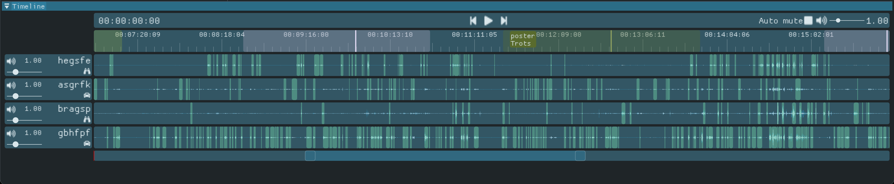
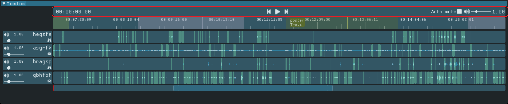
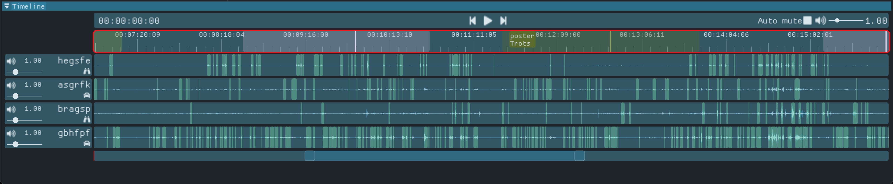
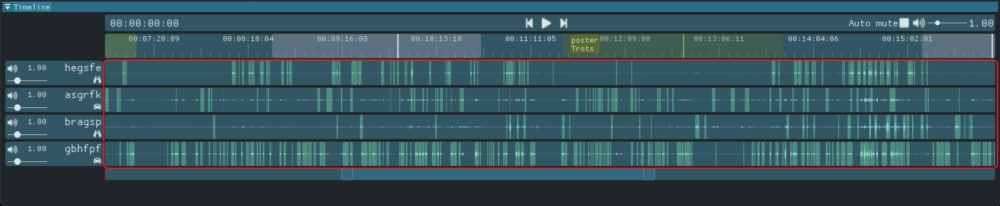
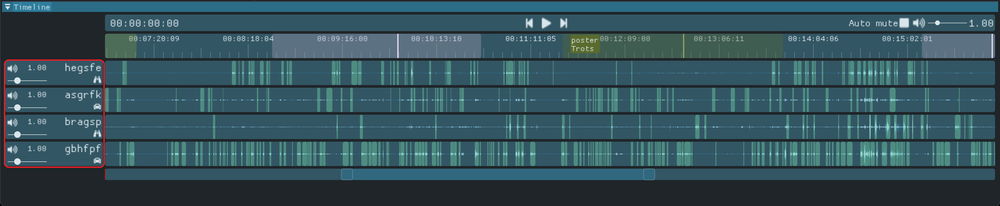
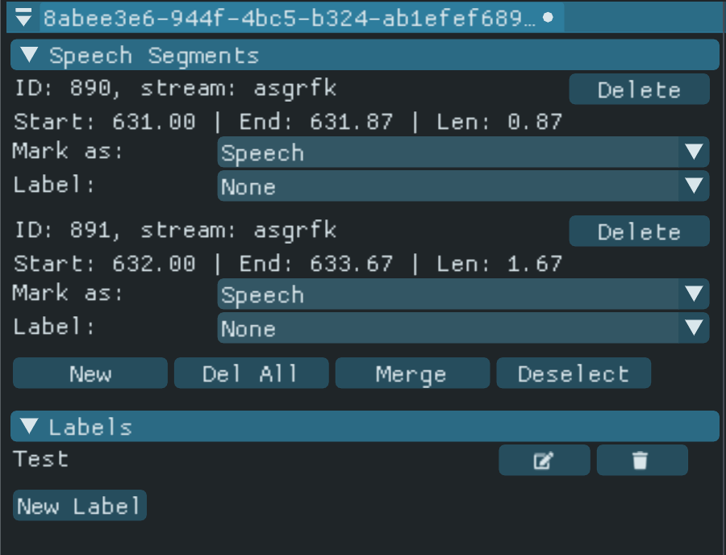
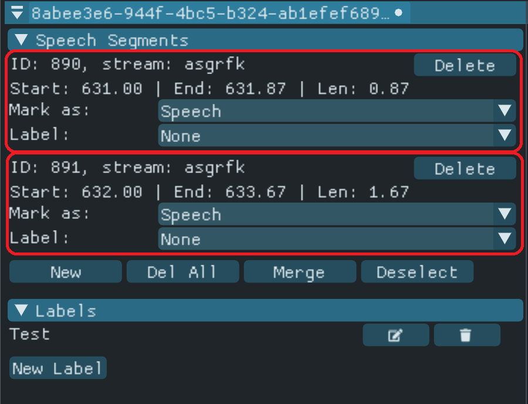
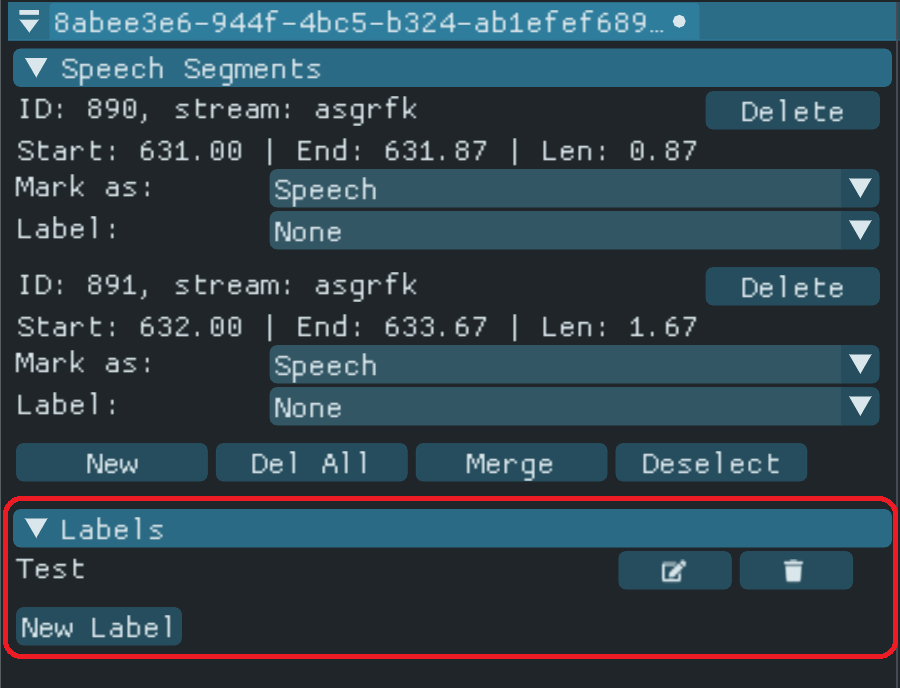

# Annotion Tool

This is a custom annotation tool created to conveniently annotate multiple video + audio recordings from  experiments with the video game Ruby's Mission. The tool has been refactored such that we could conveniently synchronize multiple media streams, to load more detailed mini game information, and finally to improve some quality of life aspects in the annotation workflow.

# Table of Contents

- [Workflow](#Workflow)
  - [Creating a new project](#creating-a-new-annotation-project)
  - [Load an existing project](#loading-a-project-from-disk)
- [Overview of the tool windows](#overview-of-the-tool-windows)
  - [Timeline window](#timeline-window)
  - [Annotation window](#annotation-window)
- [Keyboard shortcuts](#keyboard-shortcuts)
- [Project file structure](#project-file-structure)

# Workflow
---
## Creating a new annotation project

### Step 1: Creating a project from a folder

The annotation tool creates an annotation project directly from a directory that contains the required files for a project. A valid project directory should contain the following files:

- One video file per participant in the group. Since the filenames are parsed to extract some meta data for the project file, it should follow a similar structure to: 
_[player code]\_[session name]\_[session hash]\_[starting date]\_[resolution].mp4_

- One event file per participant in the group. Similar to the video files, the event files also require a specific naming format. The file names are used to couple event files to the video files. A valid format is:
_events\_[player code]\_[session name]\_[session hash].txt_

To create a new project: 
1. Press "Ctrl + N" or in the menu bar "File > New Project" to load a new session.
2. Select the appropriate folder.
3. Click "Select Folder".

**Due to an error while automatically replacing spaces with underscores in the video and/or event files, the tool may fail to load a project. To resolve this issue, manually replace the underscores in the file names for with regular lines ("-").**

### Step 2 (optional): Loading speech segments
After creating a new project we may load automatically detected speech segments in the project. These have been previously predicted using a [SileroVAD](https://github.com/snakers4/silero-vad) with a [dedicated Python script](misc/silero_bat.py). To import the speech segments:

1. Go to "Annotation > Import Speech Prediction" in the menu bar.
2. Manually select the desired speech segment files from the file dialog. The filenames are used to couple the segments to the streams. A valid speech prediction file name should follow a similar structure as:
_speechsegments\_[player code]\_[session name]\_[session hash]\_[date-time]\_[resulotion].txt_
3. Click "Open"

**Don't forget to save the project after loading your speech segments. You may save the project via the menu bar "Project > Save (As)" or by pressing Ctrl + (Shift) + S.**

### Step 3 (optional): Loading mini game events.
While creating a project we automatically load mini-game events from locally logged event files. We may load more detailed mini-game information from the analytic events that are uploaded to the analytics game server. These events are more accurate and contain extra information on the start of the cooperative parts for each mini game. To load these more detailed mini game events:

1. Go to "Annotation > Imporrt Mini-Game Events" in the menu bar.
2. Select the analytics events file. This may be downloaded by admins from the Ruby's Mission sever. 
3. Click "Open".

**Don't forget to save the project after loading the mini game events. You may save the project via the menu bar "Project > Save (As)" or by pressing Ctrl + (Shift) + S.**


### ~~Step 4 (optional): automatically mark segments as non-speech~~
**This step was previously available in the tool. This might become available as an option later on again. For now you must write your own filtering function in case you would like to apply some clever filtering.**

~~When we have created a project and loaded speech segments, we may automatically mark specific speech segments as non-speech based on a threshold analysis:~~

~~1. Press "Ctrl + Shift + F" or in the menu bar "View > Filter Window" to display the filter window.
2. Adjust the slider in the window to set the threshold for the filtering operation. The value indicates how many std. deviations below the mean of an entire stream (i.e. participant's audio signal) the mean of a speech segment must at least be to be considered non-speech.
3. Press the "Filter" button at the bottom of the window.~~

---
## Loading a project from disk
To load a previously created project from disk follow the following steps:

1. Press "Ctrl + L" or in the menu bar "File > Load Project".
2. Select the appropriate project file. Although a project file generated by the tool ends with file extension ".nnt", the data is stored as plain text.
   * A project file contains multiple paths to the corresponding media files. If any of these paths is not recognized on your system (e.g. the project file was created on another device), you are prompted to select the appropriate directory that contains **all** the correct media files on your device. After loading the session correctly, you may save the project to store the updated paths in your project file.
3. Click "Open".

# Overview of the Tool Windows

The Anotation tool contains multiple (dragable and dockable) windows for various purposes. Each of these windows is discussed below. 

---
## Timeline Window



The timeline window appears after creating or loading a project. This window is used to navigate the media and to perform annotation actions. The timeline window is constructed from multiple rows. Each of the building parts is discussed below.


**Media Buttons**



The top row contains an indicator of the current presentation time, three basic media buttons, and two options for audio control:
   * On the left side of this row you will find the current presentation time. The format of the presentation time is the following: [hh]:[mm]:[ss]:[fff].
   * In the middle of the bar, there are three simple media buttons. The middle button is used to play/pause the media. The left and right buttons are used to skip exactly one frame back or forward, accordingly.
   * On the right of the bar there are a radio button for the "auto mute" option and a master volume control. Enabling the auto-mute option automatically mutes all streams during playback that are not annotated for the current presentation time. The slider of the master volume control adjust the volume for each of the media streams. You may press the volume icon on the left side of the slider to mute/unmute all media streams. You may press the volume number indicator on the right side of the controls to reset the volume level to 1.00. 


**Scrubber**



The second row is used as a general timeline scrubber to seek through the media.
   * The red line indicates the current point in time (not visible in the current image).
   * The highlighted regions indicate the various sections where mini games are played. When you move the mouse inside of these regions, you are able to see which mini game was being played. The horizontal lines indicate the start of the group-sections for the various mini games.
   * Left-clicking on the scrubber region seeks through the media.


**Media Streams**



The rows below represent the various media streams of the participants. 
   * The dark-blue wave format indicates the maximum peak for the audio signal for a given frame (multiple frames are averaged when a pixel represents multiple frames).
   * The light-blue wave format indicates the root-mean-square peak for the audio signal for a given frame (multiple frames are averaged when a pixel represents multiple frames).

The highlighted areas indicate speech segments.
* Green: marked as "speech".
* Red: marked as "non-speech".
* Orange: marked as "unmarked".
* If a highlighted are contains a label, it will be revealed by hovering your mouse over the highlighted area.

Functionality:
* Clicking a speech segment selects/deselects the segment.
* Dragging the sides of a speech segments resizes the segment.
* Left-clicking on the audio stream seeks through the media.
* Hold the Control button to navigate through any of the speech segments (disables the functionality of (de)selecting and resizing speech segments).  

**Media Stream Controls**



The media control section is divided into a left (volume controls) and right (participant information) section. The left section contains:
  * Volume slider for adjusting the volume for the corresponding media stream.
  * Textual audio level indicator. Clicking on the text resets the audio to 1.00.
  * Audio icon. You may click the icon for muting/unmuting the corresponding media stream.
     * Ctrl + clicking the audio icon mutes/unmutes **all other streams**, while **umuting** the current stream.

The information on the right side indicates:
  * Player code information for the participant.
  * Player role information (binoculars = verzamelaar, hammer = beslisser, car = driver).

---
## Annotation Window

Loading or creating a project reveals the _annotation window_. This window exposes annotation functionality through a GUI. 



At the top of the window we see the window name. This is the hash created from the play session's name. **IMPORTANT:** a white dot next to the window's name (which is the name of your save-file) indicates that the project contains **unsaved** data. Use "Ctrl (+ Shift) + S" or in the menu bar "File > Save (As)" to save any unsaved changes to disk.

The annotation window consists of two major sections. The top section displays all of the currently selected speech segments. This section is terminated by the four buttons below the selected segments ("New", "Del All", "Merge", and "Deselect"). The second section is used to display information for the labels in the project. Both sections are a "collapsible section" which can be collapsed/revealed by clicking the corresponding headers. The functionality of the annotation window is discussed per section below.

**Speech Segments**
For each of the selected speech segments a section with information is created. Hovering the mouse over the section highlights the corresponding speech segment in the timeline window. 



The speech segment section contains the following elements from top to bottom:
* Information on the unique segment id and corresponding participant stream, and a button to delete the segment.
* Information on the start (in seconds), end (in seconds) and the duration (in seconds).
* A drop-down to mark the speech segment as "Speech", "Non Speech", or "Unmarked".
* A drop-down to select a label for the segment (or "None" for unlabeled). 

At the bottom of the speech segments section are four buttons. These buttons are:
* _New_: add a new speech segment to the project.
* _Del All_: delete all selected speech segments.
* _Merge_: merge all selected speech segments. This only works if all selected segments correspond to the same participant/media stream.
* _Deselect_: deselect all currently selected speech segments.


**Labels**
The second section contains information on the labels in the project and functionality for adjusting the labels.



At the top region of this section we find a list of all labels currently in the project. In this case there is only one label in the project named "Test". On the right side of each label we see two buttons. Clicking the button on the left allows us to rename the label. The button on the right deletes the corresponding label from the project. A warning is displayed before deleting the label. **Note** that each of the speech segments that contained the label that was adjusted using one of these buttons are automatically updated. Meaning that they are either renamed or removed. 

At the bottom of this section we see the button "New Label". This button is used for adding a new label to the project.


# Keyboard shortcuts

## General Controls

[Ctrl + W] Exits the tool.\
[Ctrl + Alt + D] Shows/hides the debug window. Useful for development purposes only.

## Project Controls

The following controls are available when a project **has not** been loaded.

[Ctrl + L] Load a project from disk.\
[Ctrl + N] Create a new project. **Note** that this shortcut is used to add a new speech segment to the project when a project has already been loaded.


The following controls are available when a project **has** been loaded.

[Ctrl + S] Save project to disk.\
[Ctrl + Shift + S] Save project to new file (creates a new project file).\
[Ctrl + U] Unload the previously loaded project.\
[Ctrl + O] Enables/Disables the "synchronizing streams" mode. When enabled, the user may drag the audio streams in the timeline tool to adjust the offset for the stream. Used for synchronizing the various streams. The synchronization modus is disabled automatically after adjusting the offset for a single stream. When pressing [Esc] while dragging a stream, the action is terminated automatically, the stream is reset to its previous offset and the synchronization modus is disabled. 

## Media Controls

[Spacebar] Play/Pause media playback.\
[Left] Skip a single frame back and pauses media.\
[Right] Forward a single frame and pauses media.\
[Ctrl + Alt + F] Auto focus on the current frame when it goes out-of-view when playing the media. 

## Annotation Controls (Only when a project has been loaded.)

[Ctrl + Z] Undo action.\
[Ctrl + Y] Redo action.

[J] Seek to the start of the _first_ selected frame.\
[Del] Delete **all** selected segments.

[Ctrl + X] Mark **all** selected segments as "speech".\
[Ctrl + C] Mark **all** selected segments as "non-speech".\
[Ctrl + V] Mark **all** selected segments as "unmarked".

[Ctrl + N] Add new segment to the project via the timeline tool. When this option is selected, you may click on any of the streams to set the start/end of a new speech segment. You may then click again to determine the length of the segment.\
[Ctrl + M] Merges the selected segments only if (1) multiple segments are selected and (2) all selected segments belong to the same stream (participant).

[Ctrl + 0] Remove labels for all selected segments.\
[Ctrl + 1..9] Set label _n_ for each selected segment.

[Ctrl + Alt + L] Toggle always display highlight labels in the timeline over the highlight overlays.

# Project File Structure
Project data is stored as plain-text in a file with extension ".nnt". A valid project file has the following structure:


```
[session name] (text)
[session hash] (text)
[session start] (timestamp, yy-mm-dd-hh-mm-ss)
[session end] (timestamp, yy-mm-dd-hh-mm-ss)
[# mini game events] (integer)
[mini game event 0] (see exact format below)
...
[mini game event n]
[# of analytic events] (UNUSED! Although these are not being used, they are still in the project files. May be removed later on.)
[# segment labels] (integer)
[label 0] (text)
...
[label n] (text)
[# of streams] (integer)
[stream 0] (see exact format below)
...
[stream n]
```


## Mini game format

A mini game is stored as:

```
[mini game type]:[start in ms]:[duration in ms]:[(optional) start cooperative part as offset in ms]:[(optional)emotion mini game is centered on] (text separated by colons)
```


## Stream format

A stream contains all information on a single participant's data. The data stored for a stream is as follows:

```
[player code] (text)
[player role] (text)
[media path] (text, path to media file)
[start of stream] (timestamp, yy-mm-dd-hh-mm-ss)
[offset] (media offset in milliseconds)
[# speech segments] (integer)
[speech segment 0] (see specific format below)
...
[speech segment n]
```


## Speech segment

A speech segment is stored as:

```
[id]:[state]:[start in sec]:[end in sec]:[label ("null" if no label)]
```
